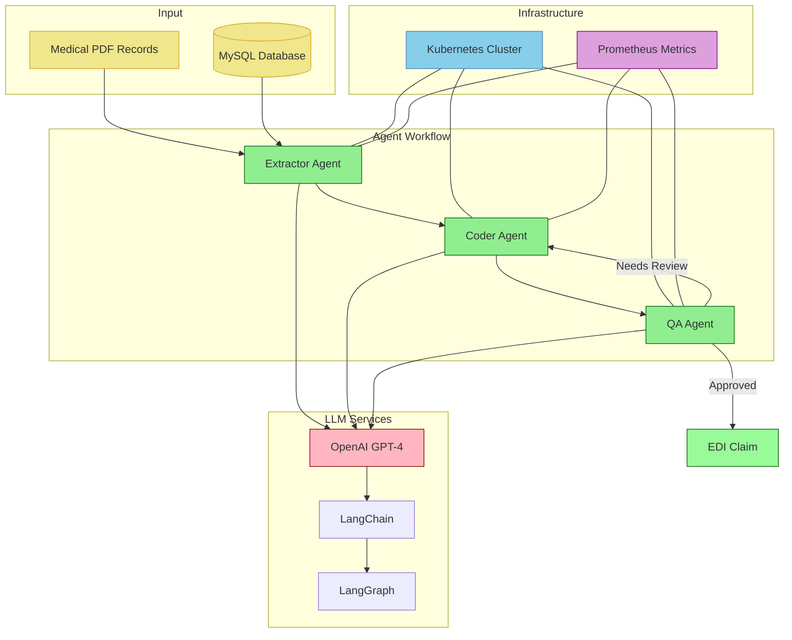

# ClaimBot837: AI-Powered Healthcare Claims Processing

ClaimBot837 is an advanced healthcare claims automation system that uses AI agents to process and generate compliant EDI claims from medical records.

## Features

- 🤖 Multi-Agent Architecture for intelligent claims processing
- 🏥 Automated EDI X12 837 Professional claim generation
- ✅ Built-in quality assurance and compliance checking
- 🔄 Iterative improvement through AI-powered feedback
- 📊 Prometheus metrics for monitoring
- 🚀 Kubernetes-ready deployment

## System Architecture



### Architecture Overview

1. **Input Processing**
   - Medical PDF records are uploaded through the web interface
   - Patient and insurance data is stored in MySQL database

2. **Agent Workflow**
   - **Extractor Agent**: Processes inputs and extracts structured information
   - **Coder Agent**: Generates EDI claims using extracted data
   - **QA Agent**: Validates claims for compliance and accuracy

3. **LLM Integration**
   - OpenAI GPT-4 powers the intelligent processing
   - LangChain provides the agent framework
   - LangGraph manages the workflow orchestration

4. **Infrastructure**
   - Kubernetes manages deployment and scaling
   - Prometheus collects performance metrics
   - Load balancer handles incoming traffic

5. **Data Flow**
   - PDF → Extractor → Coder → QA → EDI Claim
   - Feedback loop from QA to Coder for improvements
   - Metrics collection at each step

## Architecture

The system uses a graph-based workflow with specialized AI agents:

- **Extractor Agent**: Processes medical records and extracts patient/insurance information
- **Coder Agent**: Generates EDI claims based on extracted information
- **QA Agent**: Reviews and validates generated claims

## Prerequisites

- Python 3.9+
- MySQL Database
- OpenAI API Key
- Kubernetes cluster
- Docker

## Local Development

1. **Setup Virtual Environment**
   ```bash
   python -m venv venv
   source venv/bin/activate  # Linux/Mac
   # or
   .\venv\Scripts\activate  # Windows
   ```

2. **Install Dependencies**
   ```bash
   make install
   ```

3. **Configure Environment**
   Create a `.env` file with:
   ```env
   OPENAI_API_KEY=your_api_key
   DB_HOST=localhost
   DB_PORT=3306
   DB_NAME=claims
   DB_USER=root
   DB_PASSWORD=your_password
   ```

4. **Run Tests**
   ```bash
   make test
   ```

5. **Start Application**
   ```bash
   make run
   ```

## Kubernetes Deployment

### Prerequisites
- Kubernetes cluster
- kubectl configured
- Docker registry access

### 1. Build and Push Docker Image
```bash
# Build the image
docker build -t your-registry/claimbot837:latest .

# Push to registry
docker push your-registry/claimbot837:latest
```

### 2. Update Secrets
```bash
# Create base64 encoded secrets
echo -n 'your-openai-api-key' | base64
echo -n 'your-db-password' | base64

# Update the secrets in manifests/app-secrets.yaml and manifests/db-secrets.yaml
```

### 3. Deploy Application
```bash
# Create namespace
kubectl apply -f manifests/namespace.yaml

# Deploy database
kubectl apply -f manifests/storage-class.yaml
kubectl apply -f manifests/db_pv.yaml
kubectl apply -f manifests/db_pvc.yaml
kubectl apply -f manifests/db_configmap.yaml
kubectl apply -f manifests/db_secrets.yaml
kubectl apply -f manifests/deploy_mysql_vol.yaml
kubectl apply -f manifests/db_service.yaml

# Deploy application
kubectl apply -f manifests/app-secrets.yaml
kubectl apply -f manifests/deployment_ui.yaml
kubectl apply -f manifests/ui_service.yaml
```

### 4. Verify Deployment
```bash
# Check pods
kubectl -n claimbot get pods

# Check services
kubectl -n claimbot get services

# Get application URL
kubectl -n claimbot get service claimbot-ui
```

## Monitoring

The application exposes Prometheus metrics at `/metrics`. Key metrics include:
- Processing time per agent
- Success/error rates
- LLM token usage
- State size tracking

## Development Commands

```bash
# Format code
make format

# Run linters
make lint

# Clean project
make clean

# Generate documentation
make docs

# Build Docker image
make docker-build
```

## Project Structure
```
.
├── app/
│   ├── agents/          # AI agents implementation
│   ├── components/      # Core components
│   ├── utils/          # Utilities and helpers
│   ├── workflow/       # Workflow management
│   └── main.py         # Application entry point
├── manifests/          # Kubernetes configurations
├── tests/             # Test suite
├── Dockerfile         # Container definition
├── Makefile          # Development commands
└── requirements.txt   # Python dependencies
```

## Contributing

1. Fork the repository
2. Create a feature branch
3. Commit your changes
4. Push to the branch
5. Create a Pull Request

## License

This project is licensed under the MIT License - see the LICENSE file for details.

## Acknowledgments

- LangChain for the agent framework
- OpenAI for language models
- Kubernetes for container orchestration


# ReAct Agents for Coding Workflows(EDIs)
This project leverages LangGraph, LangChain tools, and advanced LLMs (e.g., GPT-4) to automate the generation of Electronic Data Interchange (EDI) claims from medical records. It integrates a MySQL database to manage patient and insurance data while using LangGraph to design a dynamic, agent-based workflow for medical coding, claim generation, and quality assurance.

## Key Features

1. LangGraph-Powered Workflow
   * Utilizes a graph-based workflow to process medical records, generate EDI claims, and perform iterative quality assurance.
   *  Modular and scalable design with well-defined tasks such as:
         - Coder creation
         - Claim generation
         - Quality review and feedback
2. Database Integration
   * MySQL database for storing and querying patient and insurance information.
   * Tools to automate schema exploration, structured queries, and data extraction.
3. Natural Language Processing
   * Employs OpenAI's GPT-4 for text comprehension, structured output generation, and decision-making.
   * Extracts critical information from medical PDFs and maps it to database entities.
4. EDI Claim Automation
   * Generates ANSI X12 837 Professional EDI claims that comply with industry standards.
   * Iteratively improves claims by incorporating feedback to ensure compliance and accuracy.

## Workflow Overview
1. Input Data
   * PDF Medical Charts: Extracts patient and insurance details from files like John_Doe.pdf.
   * MySQL Database: Retrieves stored data related to patients and their insurance providers.
2. Processing Steps
   * Coder Creation: Dynamically generates medical coder personas using GPT-4.
   * Data Extraction: Extracts structured data from medical charts and database records.
3. EDI Claim Generation: Produces fully compliant X12 837 EDI claim files.
4. Quality Assurance: Reviews claims, provides actionable feedback, and flags necessary corrections.
5. Iterative Updates: Refines claims based on feedback until final approval.

## Output 
Compliant EDI Claims: A validated X12 837 Professional EDI file, starting with the ISA segment, ready for submission.


## Project Structure 


```plaintext
├── app/
│   ├── components/       # Core functional components
│   │   ├── classes/      # Pydantic models and typed dictionaries to extract structured output from LLM 
│   │   ├── llms/         # LLM configurations and interactions
│   │   ├── nodes/        # LangGraph nodes for workflow tasks
│   │   ├── prompts/      # Custom GPT prompts
│   │   ├── sql/          # SQL utilities and database tools to build tools
│   ├── data/
│   │   ├── pdf_charts/   # Sample PDF charts for testing
│   ├── Dockerfile        # Docker configuration for app container
│   ├── main.py          # Entry point for running the workflow
│   ├── requirements.txt  # Python dependencies
├── db/
│   ├── init.sql          # MySQL initialization script
│   ├── docker-compose.yaml # Multi-container configuration for app and database
├── LICENSE               # Project license
├── README.md             # Project documentation


# Setup and Usage
Prerequisites
   Python 3.9+ (Ensure you have the required version installed)
   MySQL (Database for patient and insurance data)
   Docker (Optional but recommended for environment setup)
