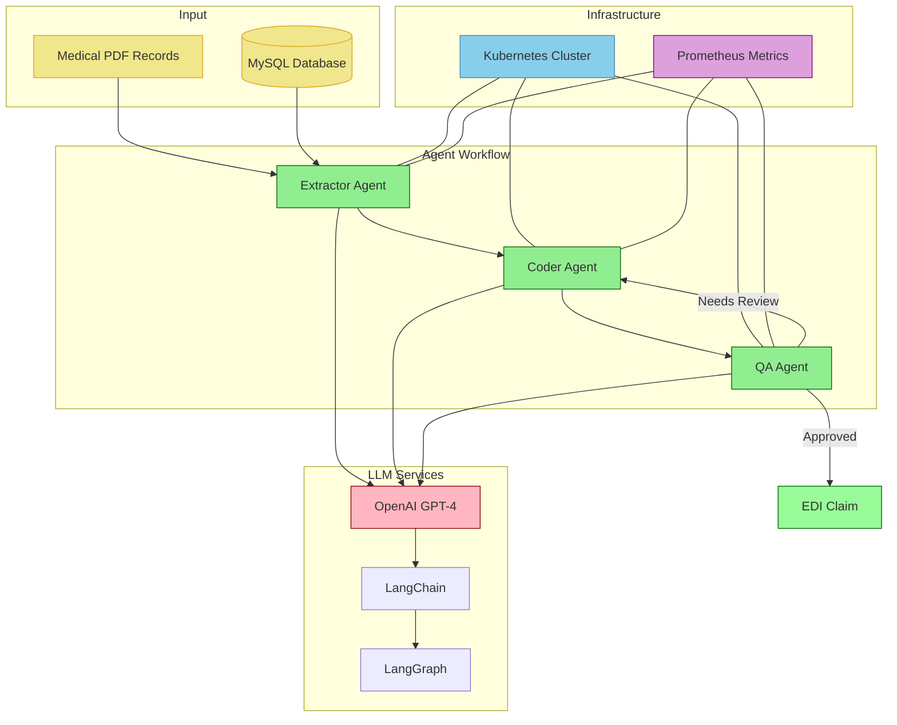

# NeuroCoder: Intelligent Healthcare Claims Processing System

An advanced AI-powered healthcare claims automation platform that uses multi-agent architecture to process medical records and generate compliant EDI X12 837 claims.

## Overview

NeuroClaim transforms healthcare claims processing through intelligent automation. The system employs specialized AI agents working in concert to extract medical information, generate accurate claims, and ensure compliance with industry standards. Built with LangGraph and OpenAI GPT-4, it offers a scalable, Kubernetes-ready solution for healthcare organizations.

## Key Features

- **Multi-Agent Architecture**: Specialized AI agents for extraction, coding, and quality assurance
- **EDI X12 837 Compliance**: Generates industry-standard professional claims
- **Kubernetes Ready**: Production-ready deployment with comprehensive manifests
- **Quality Assurance**: Built-in validation and compliance checking
- **Prometheus Metrics**: Comprehensive monitoring and performance tracking
- **MySQL Integration**: Robust database management for patient and insurance data

## System Architecture



## Agent Workflow

1. **Extractor Agent**: Processes medical PDF records and extracts structured information
2. **Coder Agent**: Generates EDI X12 837 claims using extracted data
3. **QA Agent**: Validates claims for compliance and accuracy with feedback loops

## Project Structure

```
NeuroClaim/
├── app/
│   ├── agents/               # AI agents implementation
│   │   ├── base_agent.py     # Base agent class
│   │   ├── extractor_agent.py # Data extraction agent
│   │   ├── coder_agent.py    # Claim generation agent
│   │   └── qa_agent.py       # Quality assurance agent
│   ├── components/           # Core components
│   │   ├── classes.py        # Pydantic models
│   │   ├── llms.py           # LLM configurations
│   │   ├── nodes.py          # LangGraph nodes
│   │   ├── prompts.py        # GPT prompts
│   │   └── sql.py            # Database utilities
│   ├── data/                 # Sample data
│   ├── templates/            # Web templates
│   ├── static/               # Static assets
│   ├── workflow/             # Workflow management
│   └── main.py               # Application entry point
├── manifests/                # Kubernetes configurations
├── db/                       # Database setup
├── Dockerfile                # Container configuration
├── Makefile                  # Development commands
└── requirements.txt          # Dependencies
```

## Installation

### Prerequisites

- Python 3.9+
- MySQL Database
- OpenAI API Key
- Kubernetes cluster (for production)
- Docker

### Local Development

1. **Clone the repository:**
   ```bash
   git clone https://github.com/MahammadRafi06/NeuroClaim.git
   cd NeuroClaim
   ```

2. **Create virtual environment:**
   ```bash
   python -m venv venv
   source venv/bin/activate  # On Windows: venv\Scripts\activate
   ```

3. **Install dependencies:**
   ```bash
   pip install -r requirements.txt
   ```

4. **Configure environment:**
   ```bash
   cp .env.example .env
   # Edit .env with your configuration
   ```

   Required environment variables:
   ```env
   OPENAI_API_KEY=your_api_key
   DB_HOST=localhost
   DB_PORT=3306
   DB_NAME=claims
   DB_USER=root
   DB_PASSWORD=your_password
   ```

5. **Run the application:**
   ```bash
   python app/main.py
   ```

## Kubernetes Deployment

### Prerequisites
- Kubernetes cluster
- kubectl configured
- Docker registry access

### Deployment Steps

1. **Build and push Docker image:**
   ```bash
   docker build -t your-registry/neuroclaim:latest .
   docker push your-registry/neuroclaim:latest
   ```

2. **Create secrets:**
   ```bash
   # Base64 encode your secrets
   echo -n 'your-openai-api-key' | base64
   echo -n 'your-db-password' | base64
   ```

3. **Deploy to Kubernetes:**
   ```bash
   # Create namespace
   kubectl apply -f manifests/namespace.yaml
   
   # Deploy database
   kubectl apply -f manifests/storage-class.yaml
   kubectl apply -f manifests/db_pv.yaml
   kubectl apply -f manifests/db_pvc.yaml
   kubectl apply -f manifests/db_configmap.yaml
   kubectl apply -f manifests/db_secrets.yaml
   kubectl apply -f manifests/deploy_mysql_vol.yaml
   kubectl apply -f manifests/db_service.yaml
   
   # Deploy application
   kubectl apply -f manifests/app-secrets.yaml
   kubectl apply -f manifests/deployment_ui.yaml
   kubectl apply -f manifests/ui_service.yaml
   ```

4. **Verify deployment:**
   ```bash
   kubectl -n neuroclaim get pods
   kubectl -n neuroclaim get services
   ```

## Usage

### Web Interface

Access the application at `http://localhost:5000` and:

1. Upload medical PDF records
2. Review extracted information
3. Generate EDI claims
4. Download compliant X12 837 files

### API Usage

The system provides RESTful APIs for programmatic access:

```bash
curl -X POST "http://localhost:5000/process" \
     -H "Content-Type: application/json" \
     -d '{"file_path": "path/to/medical/record.pdf"}'
```

## Monitoring and Metrics

The application exposes Prometheus metrics at `/metrics`:

- Processing time per agent
- Success/error rates
- LLM token usage
- State size tracking

## Development

### Available Make Commands

```bash
make install     # Install dependencies
make test        # Run tests
make lint        # Run linters
make format      # Format code
make clean       # Clean artifacts
make docs        # Generate documentation
make run         # Run application
make docker-build # Build Docker image
```

### Testing

```bash
# Run all tests
make test

# Run specific test
pytest tests/test_agents.py -v
```

## Configuration

The system uses environment variables and configuration files:

- `.env`: Environment-specific settings
- `config.py`: Application configuration
- `manifests/`: Kubernetes configurations

## Dependencies

- LangChain & LangGraph: Agent framework
- OpenAI GPT-4: Language model
- MySQL: Database
- Flask: Web framework
- Kubernetes: Container orchestration
- Prometheus: Metrics collection

## Contributing

1. Fork the repository
2. Create a feature branch (`git checkout -b feature/amazing-feature`)
3. Commit your changes (`git commit -m 'Add amazing feature'`)
4. Push to the branch (`git push origin feature/amazing-feature`)
5. Open a Pull Request

## License

This project is licensed under the MIT License - see the LICENSE file for details.

## Author

**MahammadRafi**
- GitHub: [@MahammadRafi06](https://github.com/MahammadRafi06)
- Email: mrafi@uw.edu

## Acknowledgments

- LangChain team for the agent framework
- OpenAI for GPT-4 language model
- Kubernetes community for orchestration platform
- Healthcare industry standards organizations


# ReAct Agents for Coding Workflows(EDIs)
This project leverages LangGraph, LangChain tools, and advanced LLMs (e.g., GPT-4) to automate the generation of Electronic Data Interchange (EDI) claims from medical records. It integrates a MySQL database to manage patient and insurance data while using LangGraph to design a dynamic, agent-based workflow for medical coding, claim generation, and quality assurance.

## Key Features

1. LangGraph-Powered Workflow
   * Utilizes a graph-based workflow to process medical records, generate EDI claims, and perform iterative quality assurance.
   *  Modular and scalable design with well-defined tasks such as:
         - Coder creation
         - Claim generation
         - Quality review and feedback
2. Database Integration
   * MySQL database for storing and querying patient and insurance information.
   * Tools to automate schema exploration, structured queries, and data extraction.
3. Natural Language Processing
   * Employs OpenAI's GPT-4 for text comprehension, structured output generation, and decision-making.
   * Extracts critical information from medical PDFs and maps it to database entities.
4. EDI Claim Automation
   * Generates ANSI X12 837 Professional EDI claims that comply with industry standards.
   * Iteratively improves claims by incorporating feedback to ensure compliance and accuracy.

## Workflow Overview
1. Input Data
   * PDF Medical Charts: Extracts patient and insurance details from files like John_Doe.pdf.
   * MySQL Database: Retrieves stored data related to patients and their insurance providers.
2. Processing Steps
   * Coder Creation: Dynamically generates medical coder personas using GPT-4.
   * Data Extraction: Extracts structured data from medical charts and database records.
3. EDI Claim Generation: Produces fully compliant X12 837 EDI claim files.
4. Quality Assurance: Reviews claims, provides actionable feedback, and flags necessary corrections.
5. Iterative Updates: Refines claims based on feedback until final approval.

## Output 
Compliant EDI Claims: A validated X12 837 Professional EDI file, starting with the ISA segment, ready for submission.


## Project Structure 


```plaintext
├── app/
│   ├── components/       # Core functional components
│   │   ├── classes/      # Pydantic models and typed dictionaries to extract structured output from LLM 
│   │   ├── llms/         # LLM configurations and interactions
│   │   ├── nodes/        # LangGraph nodes for workflow tasks
│   │   ├── prompts/      # Custom GPT prompts
│   │   ├── sql/          # SQL utilities and database tools to build tools
│   │   ├── data/
│   │   │   ├── pdf_charts/   # Sample PDF charts for testing
│   │   ├── Dockerfile        # Docker configuration for app container
│   │   ├── main.py          # Entry point for running the workflow
│   │   ├── requirements.txt  # Python dependencies
│   │   └── workflow/       # Workflow management
│   ├── db/
│   │   ├── init.sql          # MySQL initialization script
│   │   ├── docker-compose.yaml # Multi-container configuration for app and database
│   │   └── workflow/       # Workflow management
│   ├── LICENSE               # Project license
│   └── README.md             # Project documentation


# Setup and Usage
Prerequisites
   Python 3.9+ (Ensure you have the required version installed)
   MySQL (Database for patient and insurance data)
   Docker (Optional but recommended for environment setup)
